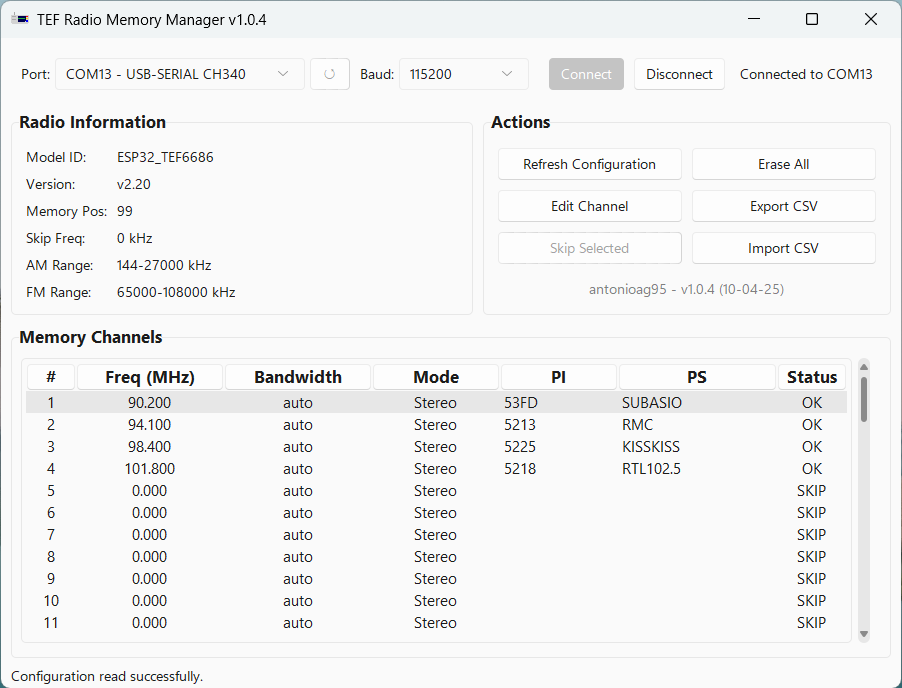

# TEF Radio Memory Manager

A Python-based graphical user interface (GUI) application for managing memory channels on TEF ESP32-based radios via a serial connection. This tool utilizes a backend library to interact with radios implementing the specific memory channel protocol.

<p align="center">
  
</p>

## Features

*   **Connect/Disconnect:** Establish serial communication with the radio.
*   **Port Management:** Auto-detect serial ports and refresh the list.
*   **Configuration Reading:** Read radio model, version, memory size, frequency ranges, and all stored channel data.
*   **Channel Display:** View memory channels in a clear table format.
*   **Channel Editing:** Modify Frequency, Bandwidth, Mode (Mono/Stereo), PI Code, and PS Text for individual channels via a dedicated dialog (double-click a channel or use the 'Edit Channel' button).
*   **Channel Skipping:** Mark individual channels (except Channel 1) to be skipped by the radio.
*   **Erase All (Skip All):** Quickly mark all channels from 2 upwards as skipped.
*   **CSV Export:** Save the current radio memory configuration to a CSV file for backup or external editing.
*   **CSV Import:** Load channel data from a CSV file. The tool performs a differential write, only updating channels on the radio that differ from the imported file to minimize EEPROM wear.
*   **Status Updates:** Provides feedback on connection status and ongoing operations.

## Requirements

*   **Python:** 3.7+
*   See `requirements.txt` for specific Python library dependencies.

## Installation and Running

### Using the Pre-built Executable (Recommended for most users)

Download the latest executable file (`.exe` for Windows) from the [Releases](https://github.com/antonioag95/tef_memory_manager/releases) page of this repository. No Python installation is required.

### From Source

1.  **Clone the repository:**
    ```bash
    git clone https://github.com/antonioag95/tef_memory_manager.git
    cd tef_memory_manager
    ```
2.  **Install dependencies:**
    ```bash
    pip install -r requirements.txt
    ```
3.  **Run the application:**
    ```bash
    python tef_memory_manager.py
    ```

## Usage

1.  Launch the application (`tef_memory_manager.py` or the downloaded executable).
2.  Select the correct **Serial Port** where your radio is connected from the dropdown list. Refresh (`↺`) if needed.
3.  Select the appropriate **Baud Rate** (default is usually 115200).
4.  Click **Connect**. The status bar should indicate a successful connection.
5.  The application will automatically attempt to **Read Configuration** upon connection. If needed, click **Refresh Configuration** to re-read.
6.  The **Radio Information** panel will populate, and the **Memory Channels** table will show the current data.
7.  Use the buttons in the **Actions** panel:
    *   **Edit Channel:** Select a channel in the table and click this (or double-click the channel) to open the edit dialog. Make changes and click **OK** to write to the radio.
    *   **Skip Selected:** Select a channel (not Channel 1) and click to mark it as skipped.
    *   **Erase All:** Skips channels 2 through the maximum. Requires confirmation.
    *   **Export CSV:** Save the current channel list to a file.
    *   **Import CSV:** Load channels from a CSV file. You will be prompted to confirm before writing changes to the radio.
8.  Click **Disconnect** when finished.

## Supported Radios

This application is specifically designed and tested for TEF ESP32-based radios running the following firmware:

*   **PE5PVB's TEF6686_ESP32:** [https://github.com/PE5PVB/TEF6686_ESP32](https://github.com/PE5PVB/TEF6686_ESP32)

This firmware uses a specific serial communication protocol for reading ('s' command) and writing ('S' command) memory channels, which this application implements. While other firmware forks *might* potentially work if they strictly adhere to the exact same protocol structure and responses, only the linked PE5PVB firmware is officially supported and confirmed to be compatible at this time.

## CSV Format

The CSV import/export functions use the following header:

```csv
Channel,Frequency kHz,Bandwidth Code,Mono/Stereo Code,PI Code,PS Text
```

*   **Channel:** Memory position number (integer, 1 to max).
*   **Frequency kHz:** Frequency in kilohertz (integer, use 0 or the radio's specific skip value to mark as skipped).
*   **Bandwidth Code:** Numeric code for bandwidth (integer). These codes correspond to the values supported by the target radio firmware (e.g., 0 for Auto FM, 1-16 for specific FM bandwidths, 1-4 for specific AM bandwidths). Refer to the firmware documentation for exact mappings if needed.
*   **Mono/Stereo Code:** 0 for Mono, 1 for Stereo (integer).
*   **PI Code:** Program Identification (hexadecimal string, max 4 chars).
*   **PS Text:** Program Service text (string, max 8 chars).

## License

This program is free software; you can redistribute it and/or modify it under the terms of the **GNU General Public License** as published by the Free Software Foundation; either version 3 of the License, or (at your option) any later version.

This program is distributed in the hope that it will be useful, but **WITHOUT ANY WARRANTY**; without even the implied warranty of MERCHANTABILITY or FITNESS FOR A PARTICULAR PURPOSE. See the GNU General Public License for more details.

## Author

*   **antonioag95**
